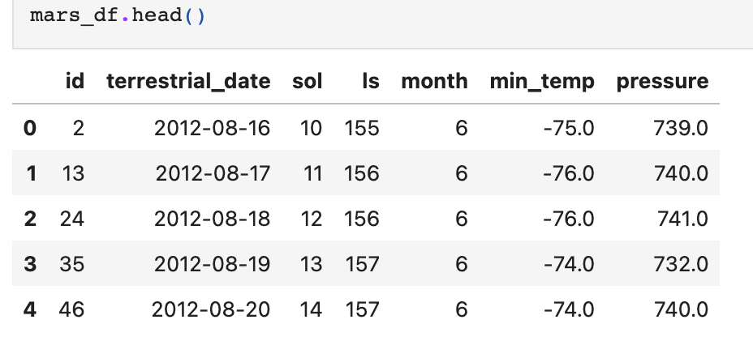
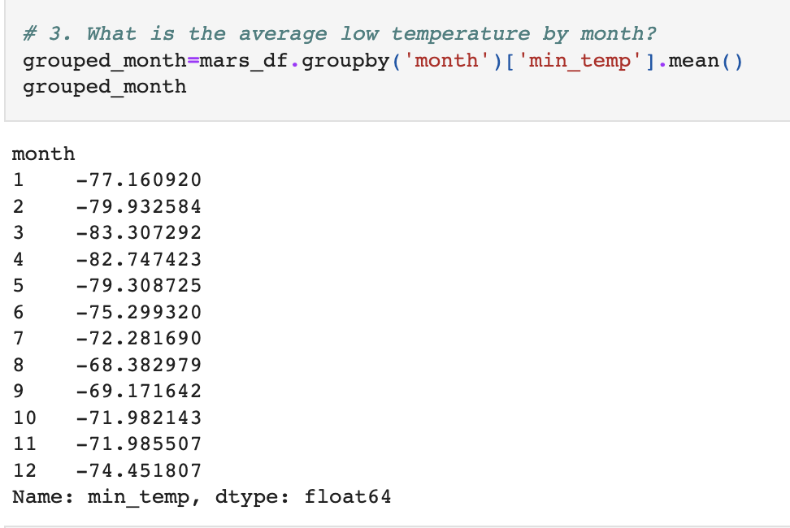
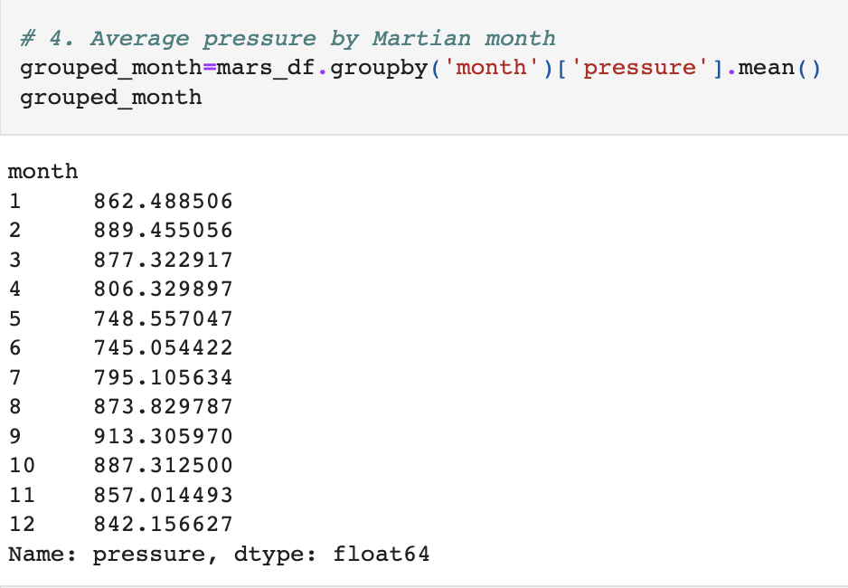

# mars_scraping
Module 11 activity, using web scraping to find and extract data from a website.

This challenge scrapes titles and previews text from Mars News using
automated browsing (with Splinter) to visit the Mars news site, and the HTML code was extracted (with Beautiful Soup).
The titles and preview text of the news articles were scraped and extracted.
The scraped information was stored in the specified Python data structure—specifically, a list of dictionaries.

Part 2: Scrape and Analyze Mars Weather Data
The HTML table was extracted into a Pandas DataFrame. Either Pandas or Splinter and Beautiful Soup were used to scrape the data. 
The columns have the correct headings and data types. 

The data was analyzed to answer the following questions: 
How many months exist on Mars? 
How many Martian days' worth of data are there? 
The data was analyzed to answer the following questions, and a data visualization was created to support each answer
Which month, on average, has the lowest temperature? The highest? 

Which month, on average, has the lowest atmospheric pressure? The highest? 

How many terrestrial days exist in a Martian year? A visual estimate within 25% was made. 
The DataFrame was exported into a CSV file. 
